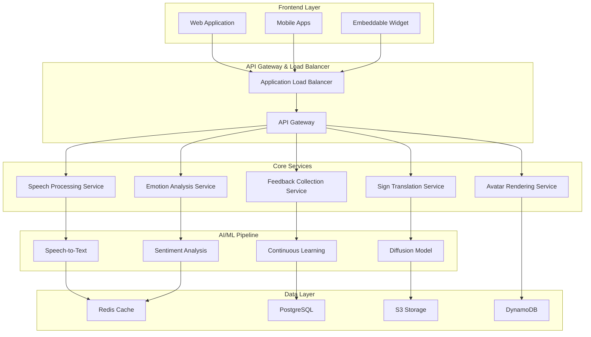
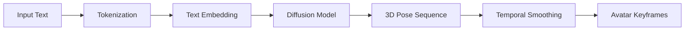
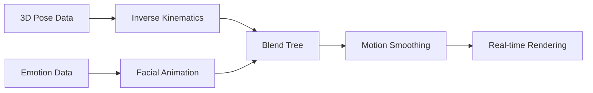
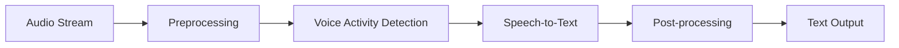

# Design Document: Scribe Real-Time Sign Language Translation Platform

## Overview

Scribe is a real-time generative AI platform that converts spoken language into expressive sign language using customizable 3D avatars. The platform serves 466 million Deaf and Hard-of-Hearing users worldwide by providing instant, accurate, and emotionally expressive sign language translation for digital content, live conversations, emergency communications, and educational scenarios.

The system combines three core AI innovations: diffusion models trained on thousands of sign language videos for natural movement generation, emotion-aware synthesis that adapts signing style based on speech sentiment, and continuous learning capabilities that improve accuracy through user feedback. Built on AWS infrastructure, Scribe delivers sub-300ms latency for real-time communication while maintaining high accuracy and natural expression.

**Target Usage Scenarios:**
- **Live Communication**: Real-time conversation translation in meetings, social interactions, and video calls
- **Emergency Services**: Priority translation for critical communications when interpreters are unavailable
- **Education**: Accessible content delivery for online learning and classroom environments
- **Digital Content**: Sign language overlay for videos, presentations, and web content
- **Healthcare**: Patient-provider communication in medical settings

## Architecture Design

### High-Level Architecture



### Component Interaction Flow

**Real-Time Translation Pipeline:**
1. **Audio Capture**: Frontend captures audio via WebRTC/MediaRecorder API
2. **Speech Processing**: Audio streamed to Speech Processing Service for real-time STT
3. **Parallel Analysis**: Text simultaneously processed by Emotion Analysis and Sign Translation services
4. **Motion Generation**: Diffusion model generates 3D keyframe sequences with emotional modulation
5. **Avatar Rendering**: 3D avatar renders sign language with synchronized facial expressions
6. **Streaming Delivery**: Rendered frames streamed back to client via WebSocket connection

**Latency Optimization:**
- **Predictive Processing**: Begin emotion analysis during speech-to-text conversion
- **Keyframe Caching**: Pre-compute common sign sequences and store in Redis
- **Progressive Rendering**: Stream avatar frames as they're generated rather than waiting for complete sequences
- **Edge Deployment**: Deploy inference models closer to users via AWS Lambda@Edge

### Scalability and Fault Tolerance

**Horizontal Scaling:**
- Auto-scaling groups for all service tiers based on CPU/memory utilization
- Container orchestration via Amazon ECS with Fargate for serverless scaling
- Database read replicas and connection pooling for high-concurrency scenarios

**Fault Tolerance:**
- Multi-AZ deployment across 3 availability zones
- Circuit breaker patterns for external service dependencies
- Graceful degradation: fallback to text display when avatar rendering fails
- Health checks and automatic service recovery via AWS Application Load Balancer

**Performance Targets:**
- **Total Latency**: <300ms from speech input to avatar display
- **Throughput**: 10,000+ concurrent translation sessions
- **Availability**: 99.9% uptime with <1 second recovery time

## AI & ML Design

### Diffusion Model for Sign Language Motion

**Architecture**: Graph Neural Network-based diffusion model operating on SMPL-X body skeleton, inspired by Neural Sign Actors research. The model generates anatomically correct 3D pose sequences from text input.

**Training Data Pipeline:**
- **Dataset**: 50,000+ hours of professional sign language videos (ASL, BSL, regional variants)
- **Preprocessing**: Pose estimation via MediaPipe Holistic to extract 3D keypoints
- **Augmentation**: Synthetic variations in signing speed, hand size, and body proportions
- **Quality Control**: Human expert validation for accuracy and cultural appropriateness

**Inference Flow:**


**Model Specifications:**
- **Architecture**: Transformer-based conditional diffusion with graph convolutions
- **Input**: Text tokens + emotion embeddings + user preferences
- **Output**: Sequence of 3D poses (468 facial landmarks + 21 hand keypoints + body pose)
- **Inference Time**: <150ms for 5-second sign sequence
- **Model Size**: 2.8GB (quantized to 1.4GB for edge deployment)

### Emotion-Aware Synthesis Pipeline

**Sentiment Detection:**
- **Primary Model**: Fine-tuned BERT for speech-to-text sentiment classification
- **Audio Features**: Prosodic analysis (pitch, tempo, volume) via librosa
- **Real-time Processing**: Sliding window analysis with 500ms overlap
- **Output**: Emotion vector (valence, arousal, dominance) + discrete emotions

**Signing Modulation:**
- **Intensity Scaling**: Adjust gesture amplitude based on emotional intensity
- **Temporal Modulation**: Vary signing speed (faster for excitement, slower for sadness)
- **Facial Expression**: Map emotions to facial action units (FACS-based)
- **Spatial Dynamics**: Modify signing space (larger for anger, smaller for fear)

**Integration with Diffusion Model:**
```python
# Pseudocode for emotion-conditioned generation
emotion_embedding = emotion_encoder(sentiment_vector)
text_embedding = text_encoder(input_text)
combined_input = concatenate(text_embedding, emotion_embedding)
pose_sequence = diffusion_model.generate(combined_input)
```

### Continuous Learning & Feedback Loop

**Feedback Collection:**
- **Implicit Signals**: User interaction patterns, session duration, replay frequency
- **Explicit Feedback**: Thumbs up/down, accuracy ratings, correction submissions
- **A/B Testing**: Compare model variants for accuracy and user satisfaction

**Learning Pipeline:**
- **Data Aggregation**: Collect feedback across user sessions while maintaining privacy
- **Model Retraining**: Weekly batch updates using federated learning principles
- **Validation**: Human expert review of model improvements before deployment
- **Deployment**: Blue-green deployment strategy for zero-downtime updates

**Privacy-Preserving Learning:**
- **Differential Privacy**: Add noise to aggregated feedback data
- **Federated Learning**: Train model updates locally, share only gradients
- **Data Minimization**: Retain feedback data for maximum 90 days

### Model Update and Versioning Strategy

**Version Control:**
- **Semantic Versioning**: Major.Minor.Patch (e.g., v2.1.3)
- **Model Registry**: MLflow-based registry with metadata and performance metrics
- **Rollback Capability**: Maintain previous 3 model versions for instant rollback

**Deployment Strategy:**
- **Canary Releases**: Deploy to 5% of traffic, monitor performance metrics
- **Gradual Rollout**: Increase traffic percentage based on success metrics
- **Feature Flags**: Enable/disable model features without full redeployment

## 3D Avatar & Rendering System

### Avatar Rigging and Animation Pipeline

**Base Mesh Architecture:**
- **Skeleton**: SMPL-X parametric model with 55 joints + detailed hand/face rigs
- **Topology**: Optimized 8,000-triangle mesh for real-time rendering
- **Blend Shapes**: 100+ facial expressions mapped to emotional states
- **Bone Weights**: Automatic skinning with manual refinement for natural deformation

**Animation System:**


**Real-time Animation:**
- **Inverse Kinematics**: Solve hand/arm positions from target poses
- **Motion Blending**: Smooth transitions between sign sequences
- **Procedural Animation**: Add natural micro-movements and breathing
- **Temporal Coherence**: Maintain consistent motion across frame boundaries

### Facial Expression, Hand Articulation, and Body Movement

**Facial Expression System:**
- **FACS Integration**: 46 Action Units mapped to emotional states
- **Eye Gaze**: Dynamic eye movement following hand positions
- **Lip Sync**: Mouth shapes synchronized with fingerspelling
- **Micro-expressions**: Subtle facial movements for natural appearance

**Hand Articulation:**
- **Finger Tracking**: 21 keypoints per hand with sub-millimeter precision
- **Gesture Recognition**: 500+ ASL/BSL handshapes in model vocabulary
- **Collision Detection**: Prevent finger interpenetration during complex signs
- **Physics Simulation**: Natural hand dynamics and secondary motion

**Body Movement:**
- **Posture Variation**: Subtle body sway and weight shifts
- **Shoulder Dynamics**: Natural shoulder movement during signing
- **Torso Rotation**: Body orientation changes for spatial grammar
- **Breathing Animation**: Chest movement for lifelike appearance

### Customization Options

**Avatar Appearance:**
- **Skin Tone**: 12 diverse skin tone options with realistic subsurface scattering
- **Facial Features**: Customizable face shape, eye color, hair style
- **Body Type**: Adjustable height, build, and proportions
- **Clothing**: Professional, casual, and cultural attire options

**Signing Style Preferences:**
- **Regional Variants**: ASL, BSL, Auslan, and other national sign languages
- **Signing Speed**: Adjustable from 0.5x to 2x normal speed
- **Gesture Size**: Compact, standard, or expansive signing space
- **Formality Level**: Casual vs. formal signing register

**Accessibility Features:**
- **High Contrast**: Enhanced visibility for users with visual impairments
- **Simplified Rendering**: Reduced detail mode for low-performance devices
- **Color Coding**: Optional color highlights for grammatical elements

### Performance Optimization for Real-Time Rendering

**WebGL Optimization:**
- **Level of Detail (LOD)**: Multiple mesh resolutions based on viewing distance
- **Frustum Culling**: Render only visible avatar parts
- **Texture Atlasing**: Combine multiple textures to reduce draw calls
- **Instanced Rendering**: Efficient rendering of repeated elements

**GPU Acceleration:**
- **Vertex Shaders**: GPU-based skeletal animation and deformation
- **Compute Shaders**: Parallel processing of physics simulations
- **Texture Compression**: ASTC/DXT compression for reduced memory usage
- **Memory Management**: Efficient buffer allocation and garbage collection

**Performance Targets:**
- **Frame Rate**: Consistent 60 FPS on desktop, 30 FPS on mobile
- **Memory Usage**: <512MB GPU memory, <256MB system RAM
- **Battery Impact**: <10% additional battery drain on mobile devices
- **Loading Time**: <3 seconds for initial avatar load

## Speech & Language Pipeline

### Speech-to-Text Flow

**Real-Time STT Architecture:**
- **Primary Engine**: AWS Transcribe Streaming with custom acoustic models
- **Fallback Engine**: Google Cloud Speech-to-Text for redundancy
- **Custom Models**: Fine-tuned on Deaf/HoH speech patterns and accents
- **Noise Reduction**: Spectral subtraction and Wiener filtering

**Streaming Pipeline:**


**Quality Optimization:**
- **Adaptive Sampling**: Dynamic audio quality based on network conditions
- **Speaker Adaptation**: Personalized acoustic models for frequent users
- **Confidence Scoring**: Quality metrics for downstream processing decisions
- **Error Correction**: Context-aware spelling and grammar correction

### Language Normalization for Sign Grammar

**Text Preprocessing:**
- **Tokenization**: Sentence and word boundary detection
- **Named Entity Recognition**: Identify proper nouns, dates, numbers
- **Dependency Parsing**: Extract grammatical relationships
- **Semantic Role Labeling**: Identify agent, action, object relationships

**Sign Language Grammar Adaptation:**
- **Word Order**: Convert English SVO to ASL topic-comment structure
- **Spatial Grammar**: Map pronouns and references to 3D signing space
- **Temporal Markers**: Convert tense to appropriate temporal signs
- **Classifier Integration**: Use appropriate classifier handshapes for objects

**Example Transformation:**
```
Input: "I will meet you at the restaurant tomorrow"
Normalized: "TOMORROW RESTAURANT YOU-ME MEET"
Spatial: [Point to future] [Establish location] [Point to addressee] [Sign MEET]
```

### Multilingual and Regional Sign Language Support

**Supported Languages:**
- **Primary**: American Sign Language (ASL), British Sign Language (BSL)
- **Phase 2**: Auslan, LSF (French), DGS (German), JSL (Japanese)
- **Regional Variants**: Regional ASL dialects, cultural adaptations

**Localization Framework:**
- **Sign Dictionaries**: Comprehensive lexicons for each sign language
- **Cultural Adaptation**: Culturally appropriate signs and expressions
- **Grammar Rules**: Language-specific grammatical structures
- **Fingerspelling**: Alphabet systems for each supported language

**Implementation Strategy:**
- **Modular Architecture**: Pluggable language modules
- **Transfer Learning**: Leverage base model for new language variants
- **Community Contribution**: Framework for community-submitted signs
- **Quality Assurance**: Native signer validation for all content

## User Interface & Experience Design

### Web-First UI Layout

**Primary Interface Components:**
```
┌─────────────────────────────────────────────────────────┐
│                    Header Navigation                     │
├─────────────────────────────────────────────────────────┤
│  Controls Panel  │        Avatar Viewport        │ Chat │
│                  │                               │      │
│  ┌─────────────┐ │  ┌─────────────────────────┐  │ ┌──┐ │
│  │ Start/Stop  │ │  │                         │  │ │  │ │
│  │ Mic Toggle  │ │  │     3D Avatar Display   │  │ │  │ │
│  │ Settings    │ │  │                         │  │ │  │ │
│  │ Feedback    │ │  └─────────────────────────┘  │ │  │ │
│  └─────────────┘ │                               │ └──┘ │
├─────────────────────────────────────────────────────────┤
│              Live Transcript Display                     │
└─────────────────────────────────────────────────────────┘
```

**Avatar Viewport (Primary Focus):**
- **Dimensions**: 16:9 aspect ratio, responsive scaling
- **Background**: Neutral gradient or customizable environment
- **Camera Controls**: Fixed optimal viewing angle with optional user adjustment
- **Quality Toggle**: HD/Standard/Low quality based on device capabilities

**Control Panel:**
- **Microphone Control**: Large, accessible start/stop button with visual feedback
- **Volume Meter**: Real-time audio level indicator
- **Language Selection**: Dropdown for sign language variants
- **Speed Control**: Slider for signing speed adjustment (0.5x - 2x)
- **Avatar Customization**: Quick access to appearance settings

### Accessibility-First Design Principles

**Visual Accessibility:**
- **High Contrast Mode**: WCAG AAA compliant color schemes
- **Font Scaling**: Support for 200%+ text scaling
- **Focus Indicators**: Clear keyboard navigation highlights
- **Screen Reader Support**: Comprehensive ARIA labels and descriptions

**Motor Accessibility:**
- **Large Touch Targets**: Minimum 44px touch targets for mobile
- **Keyboard Navigation**: Full functionality via keyboard shortcuts
- **Voice Commands**: Alternative input method for users with motor impairments
- **Customizable Controls**: Repositionable UI elements

**Cognitive Accessibility:**
- **Simple Language**: Clear, concise interface text
- **Consistent Layout**: Predictable UI patterns across all screens
- **Progress Indicators**: Clear feedback for all user actions
- **Error Prevention**: Confirmation dialogs for destructive actions

### Controls for Speed, Emotion Intensity, Avatar Selection

**Speed Control Interface:**
- **Visual Slider**: Intuitive speed adjustment with real-time preview
- **Preset Buttons**: Quick access to common speeds (Slow, Normal, Fast)
- **Adaptive Speed**: Automatic adjustment based on content complexity
- **Memory**: Remember user preferences across sessions

**Emotion Intensity Settings:**
- **Sensitivity Slider**: Adjust how strongly emotions affect signing
- **Emotion Previe eal-time preview of emotional expressions
- **Manual Override**: Option to disable emotion detection
- **Calibration**: Personal emotion baseline adjustment

**Avatar Selection:**
- **Gallery View**: Grid of available avatar options with previews
- **Customization Panel**: Detailed appearance modification tools
- **Preview Mode**: Test avatar with sample signs before selection
- **Save Profiles**: Multiple saved avatar configurations

### Mobile and Kiosk Considerations

**Mobile Optimization:**
- **Touch-First Design**: Large, finger-friendly controls
- **Portrait Layout**: Optimized for vertical phone orientation
- **Gesture Support**: Swipe gestures for common actions
- **Offline Mode**: Basic functionality without internet connection

**Kiosk Mode:**
- **Full-Screen Interface**: Immersive, distraction-free experience
- **Auto-Reset**: Return to default state after inactivity
- **Accessibility Compliance**: ADA-compliant physical and digital interface
- **Multi-Language Support**: Easy language switching for diverse users

**Responsive Breakpoints:**
- **Mobile**: <768px - Single column layout, simplified controls
- **Tablet**: 768px-1024px - Two-column layout, medium avatar size
- **Desktop**: >1024px - Full three-column layout, large avatar display
- **Kiosk**: >1920px - Extra-large avatar, simplified navigation

## Backend & Cloud Infrastructure

### AWS-Based Infrastructure Design

**Core Services Architecture:**
```mermaid
graph TB
    subgraph "Edge Layer"
        CF[CloudFront CDN]
        EDGE[Lambda@Edge]
    end
    
    subgraph "Application Layer"
        ALB[Application Load Balancer]
        ECS[ECS Fargate Cluster]
        LAMBDA[Lambda Functions]
    end
    
    subgraph "AI/ML Services"
        SAGE[SageMaker Endpoints]
        BATCH[Batch Processing]
        TRANS[Transcribe Streaming]
    end
    
    subgraph "Data Layer"
        RDS[RDS PostgreSQL]
        REDIS[ElastiCache Redis]
        S3[S3 Storage]
        DYNAMO[DynamoDB]
    end
    
    subgraph "Monitoring & Security"
        CW[CloudWatch]
        WAF[AWS WAF]
        SECRETS[Secrets Manager]
    end
    
    CF --> ALB
    EDGE --> LAMBDA
    ALB --> ECS
    ECS --> SAGE
    ECS --> TRANS
    SAGE --> S3
    ECS --> RDS
    ECS --> REDIS
    ECS --> DYNAMO
```

**Service Specifications:**
- **Compute**: ECS Fargate with auto-scaling (2-100 instances)
- **AI/ML**: SageMaker real-time endpoints with auto-scaling
- **Database**: RDS PostgreSQL Multi-AZ with read replicas
- **Cache**: ElastiCache Redis cluster with failover
- **Storage**: S3 with CloudFront for global content delivery

### APIs, Streaming Protocols, and Latency Handling

**API Architecture:**
- **REST APIs**: Standard CRUD operations via API Gateway
- **WebSocket APIs**: Real-time bidirectional communication
- **GraphQL**: Flexible data querying for complex UI requirements
- **gRPC**: High-performance service-to-service communication

**Streaming Protocols:**
- **WebRTC**: Peer-to-peer audio streaming with STUN/TURN servers
- **WebSocket**: Real-time avatar frame streaming
- **Server-Sent Events**: One-way status updates and notifications
- **HTTP/2 Push**: Proactive resource delivery

**Latency Optimization:**
- **Edge Computing**: Deploy inference models at CloudFront edge locations
- **Connection Pooling**: Persistent connections to reduce handshake overhead
- **Predictive Caching**: Pre-load common sign sequences based on context
- **Compression**: Gzip/Brotli compression for all text-based responses

**API Endpoints:**
```
POST /api/v1/translate/stream    # Start real-time translation
GET  /api/v1/avatars            # List available avatars
PUT  /api/v1/user/preferences   # Update user settings
POST /api/v1/feedback           # Submit user feedback
GET  /api/v1/health             # Service health check
```

### Security, Privacy, and Compliance

**Data Encryption:**
- **In Transit**: TLS 1.3 for all communications
- **At Rest**: AES-256 encryption for all stored data
- **Key Management**: AWS KMS with automatic key rotation
- **Certificate Management**: AWS Certificate Manager with auto-renewal

**Privacy Protection:**
- **Data Minimization**: Collect only necessary data for functionality
- **Retention Policies**: Automatic deletion of audio data after 24 hours
- **Anonymization**: Remove personal identifiers from analytics data
- **User Consent**: Granular consent management for data usage

**Compliance Framework:**
- **GDPR**: Right to deletion, data portability, consent management
- **CCPA**: California privacy rights and data transparency
- **HIPAA**: Healthcare data protection for medical use cases
- **ADA**: Digital accessibility compliance for public services

**Security Measures:**
- **WAF Protection**: AWS WAF with custom rules for attack prevention
- **DDoS Protection**: AWS Shield Advanced for enterprise customers
- **Access Control**: IAM roles with least-privilege principles
- **Audit Logging**: CloudTrail for all API and infrastructure changes

## Performance & Reliability

### Latency Targets

**End-to-End Latency Breakdown:**
- **Audio Capture to STT**: <100ms (streaming with 50ms chunks)
- **Text Processing**: <50ms (parallel emotion analysis and translation)
- **Motion Generation**: <100ms (diffusion model inference)
- **Avatar Rendering**: <50ms (GPU-accelerated WebGL)
- **Total Target**: <300ms from speech to avatar display

**Optimization Strategies:**
- **Predictive Processing**: Begin downstream processing before STT completion
- **Model Quantization**: Reduce model size by 50% with minimal accuracy loss
- **Edge Deployment**: Deploy models closer to users via Lambda@Edge
- **Caching**: Redis cache for common phrases and sign sequences

### Real-Time Streaming Guarantees

**Service Level Objectives (SLOs):**
- **Availability**: 99.9% uptime (8.76 hours downtime per year)
- **Latency**: 95th percentile <300ms, 99th percentile <500ms
- **Throughput**: 10,000 concurrent sessions per region
- **Error Rate**: <0.1% translation failures

**Streaming Quality Assurance:**
- **Adaptive Bitrate**: Adjust quality based on network conditions
- **Buffer Management**: 2-second buffer to handle network jitter
- **Graceful Degradation**: Fallback to text display if avatar fails
- **Connection Recovery**: Automatic reconnection with state preservation

### Monitoring, Logging, and Fallback Mechanisms

**Monitoring Stack:**
- **Application Metrics**: Custom CloudWatch metrics for business KPIs
- **Infrastructure Monitoring**: AWS X-Ray for distributed tracing
- **Real User Monitoring**: Client-side performance tracking
- **Synthetic Monitoring**: Automated testing from multiple global locations

**Key Metrics:**
- **Translation Accuracy**: User feedback scores and correction rates
- **System Performance**: Latency, throughput, error rates
- **User Experience**: Session duration, feature usage, satisfaction scores
- **Business Metrics**: Active users, conversion rates, revenue impact

**Alerting Strategy:**
- **Critical Alerts**: Page on-call engineer for service outages
- **Warning Alerts**: Slack notifications for performance degradation
- **Trend Analysis**: Weekly reports on performance and usage patterns
- **Automated Response**: Auto-scaling and failover for common issues

**Fallback Mechanisms:**
- **Service Degradation**: Disable non-essential features during high load
- **Model Fallback**: Switch to simpler models if primary models fail
- **Text Display**: Show transcript if avatar rendering fails
- **Offline Mode**: Basic functionality with cached content

## Correctness Properties

*A property is a characteristic or behavior that should hold true across all valid executions of a system—essentially, a formal statement about what the system should do. Properties serve as the bridge between human-readable specifications and machine-verifiable correctness guarantees.*

### Property 1: End-to-End Latency Performance
*For any* spoken input, the total time from audio capture to avatar display should be less than 300ms under normal operating conditions
**Validates: Requirements 1.1, 1.2, 1.3**

### Property 2: Multi-Speaker Voice Separation
*For any* audio input containing multiple speakers, the system should maintain translation accuracy equivalent to single-speaker scenarios
**Validates: Requirements 1.4**

### Property 3: Noise Robustness
*For any* audio input with background noise up to 60dB SNR, translation quality should remain within 95% of clean audio performance
**Validates: Requirements 1.5**

### Property 4: Avatar Customization Functionality
*For any* valid customization request, applying the changes should result in the avatar displaying the requested modifications
**Validates: Requirements 2.3**

### Property 5: Emotional Response Consistency
*For any* speech input with detectable emotional content, the avatar's signing intensity and facial expressions should consistently reflect the detected emotion type and intensity
**Validates: Requirements 2.4, 3.1, 3.2**

### Property 6: Frame Rate Performance
*For any* avatar animation sequence, the rendering should maintain at least 30 frames per second on supported hardware
**Validates: Requirements 2.5**

### Property 7: Motion Smoothness
*For any* sequence of sign language gestures, transitions between signs should have smooth velocity profiles without abrupt changes exceeding anatomical limits
**Validates: Requirements 4.2**

### Property 8: Anatomical Correctness
*For any* generated sign language pose, all joint angles should remain within human anatomical limits and hand positions should be physically achievable
**Validates: Requirements 4.3**

### Property 9: Signing Variation
*For any* sign repeated multiple times, the generated movements should show natural variation while maintaining semantic correctness
**Validates: Requirements 4.4**

### Property 10: Feedback Collection and Storage
*For any* user feedback submission, the data should be successfully stored and associated with the correct translation session while maintaining user privacy
**Validates: Requirements 5.1, 5.4**

### Property 11: Learning System Prioritization
*For any* translation error reported for commonly used phrases, the correction should receive higher priority in the learning queue than errors for rare phrases
**Validates: Requirements 5.3**

### Property 12: Zero-Downtime Updates
*For any* model update deployment, the service should remain available to users throughout the update process
**Validates: Requirements 5.5**

### Property 13: Cross-Platform Compatibility
*For any* supported platform (web browsers with WebGL, iOS, Android), core translation functionality should work consistently
**Validates: Requirements 6.1, 6.2**

### Property 14: Graceful Network Degradation
*For any* network condition with limited bandwidth or high latency, the system should maintain core translation functionality with appropriate feature reduction
**Validates: Requirements 6.3**

### Property 15: Emergency Processing Priority
*For any* input containing emergency keywords, processing latency should be reduced by at least 20% compared to normal processing
**Validates: Requirements 7.1**

### Property 16: Emergency Mode Behavior
*For any* emergency mode activation, the avatar should use urgent signing styles that are visually distinct from normal signing
**Validates: Requirements 7.2**

### Property 17: Offline Emergency Access
*For any* emergency phrase in the predefined list, translation should be available without network connectivity
**Validates: Requirements 7.5**

### Property 18: UI Responsiveness
*For any* supported screen size (mobile, tablet, desktop), the user interface should adapt appropriately and maintain full functionality
**Validates: Requirements 8.5**

### Property 19: Accessibility Compliance
*For any* user interface element, it should meet WCAG 2.1 AA standards for contrast, keyboard navigation, and screen reader compatibility
**Validates: Requirements 8.7**

### Property 20: Error Recovery
*For any* system error, the user interface should display appropriate error messages and provide clear recovery options
**Validates: Requirements 8.8**

### Property 21: Data Encryption
*For any* audio data processed by the system, it should be encrypted during transmission and processing using industry-standard encryption
**Validates: Requirements 9.1**

### Property 22: Privacy Protection
*For any* user data collected, personal identifiers should be removed or anonymized, and data should be deleted according to retention policies
**Validates: Requirements 9.2, 9.3, 9.4**

## Error Handling

### Audio Processing Errors
- **Microphone Access Denied**: Graceful fallback to text input with clear user guidance
- **Audio Quality Issues**: Automatic quality adjustment and user notification of potential accuracy impact
- **Network Interruption**: Local buffering with automatic reconnection and state recovery
- **STT Service Failure**: Fallback to secondary speech recognition service with minimal delay

### AI Model Errors
- **Diffusion Model Failure**: Fallback to pre-computed sign sequences for common phrases
- **Emotion Detection Failure**: Continue translation without emotional modulation
- **Model Loading Errors**: Progressive loading with basic functionality available immediately
- **Inference Timeout**: Return cached results or simplified animations to maintain real-time performance

### Rendering Errors
- **WebGL Context Loss**: Automatic context recovery with state preservation
- **GPU Memory Exhaustion**: Reduce avatar quality and complexity automatically
- **Animation Glitches**: Frame interpolation and smoothing to maintain visual continuity
- **Browser Compatibility**: Feature detection with appropriate fallbacks for unsupported browsers

### Network and Infrastructure Errors
- **API Rate Limiting**: Intelligent request queuing and user notification
- **Service Unavailability**: Circuit breaker pattern with graceful degradation
- **Database Connection Issues**: Read-only mode with cached data when possible
- **CDN Failures**: Automatic failover to backup content delivery networks

## Testing Strategy

### Dual Testing Approach

The Scribe platform requires both unit testing and property-based testing to ensure comprehensive coverage and correctness validation.

**Unit Tests** focus on:
- Specific examples that demonstrate correct behavior
- Integration points between system components
- Edge cases and error conditions
- API contract validation
- UI component behavior

**Property-Based Tests** focus on:
- Universal properties that hold across all valid inputs
- Comprehensive input coverage through randomization
- Performance characteristics under varied conditions
- System behavior with generated test data

### Property-Based Testing Configuration

**Testing Framework**: Hypothesis (Python) for backend services, fast-check (TypeScript) for frontend components

**Test Configuration**:
- Minimum 100 iterations per property test due to randomization
- Each property test must reference its corresponding design document property
- Tag format: **Feature: real-time-sign-language-translation, Property {number}: {property_text}**

**Example Property Test Structure**:
```python
@given(audio_samples=audio_strategy(), noise_levels=floats(0, 60))
def test_noise_robustness(audio_samples, noise_levels):
    """Feature: real-time-sign-language-translation, Property 3: Noise Robustness"""
    clean_accuracy = translate_audio(audio_samples)
    noisy_audio = add_noise(audio_samples, noise_levels)
    noisy_accuracy = translate_audio(noisy_audio)
    
    assert noisy_accuracy >= 0.95 * clean_accuracy
```

### Unit Testing Strategy

**Component Testing**:
- Speech processing pipeline components
- Emotion detection accuracy with known samples
- Avatar rendering performance benchmarks
- API endpoint functionality and error handling

**Integration Testing**:
- End-to-end translation pipeline
- Real-time streaming performance
- Cross-browser compatibility
- Mobile application functionality

**Performance Testing**:
- Load testing with concurrent users
- Latency measurement under various conditions
- Memory usage and garbage collection impact
- Battery consumption on mobile devices

### Test Data Management

**Synthetic Data Generation**:
- Procedural audio generation for speech testing
- Emotion-labeled speech samples for sentiment analysis
- 3D pose sequences for animation testing
- Network condition simulation for robustness testing

**Privacy-Compliant Testing**:
- Use synthetic data for all automated testing
- Anonymized real data only for manual validation
- Secure test environments with data encryption
- Automatic test data cleanup after execution

## Risks & Mitigations

### Technical Risks

**AI Model Performance Risks:**
- **Risk**: Diffusion model inference latency exceeds real-time requirements
- **Mitigation**: Model quantization, edge deployment, and progressive quality reduction
- **Monitoring**: Real-time latency tracking with automated alerts

**Scalability Risks:**
- **Risk**: System cannot handle peak concurrent users during emergencies
- **Mitigation**: Auto-scaling infrastructure, load balancing, and capacity planning
- **Monitoring**: Resource utilization dashboards and predictive scaling

**Browser Compatibility Risks:**
- **Risk**: WebGL performance varies significantly across devices and browsers
- **Mitigation**: Progressive enhancement, fallback rendering modes, and device detection
- **Monitoring**: Client-side performance telemetry and error reporting

### Ethical and Accessibility Risks

**Cultural Sensitivity Risks:**
- **Risk**: Sign language translations may not reflect cultural nuances or regional variations
- **Mitigation**: Community involvement in content validation, regional expert review
- **Monitoring**: User feedback analysis and cultural appropriateness audits

**Accessibility Exclusion Risks:**
- **Risk**: Platform may inadvertently exclude users with additional disabilities
- **Mitigation**: Comprehensive accessibility testing, user research with diverse disability communities
- **Monitoring**: Accessibility compliance audits and user experience studies

**Digital Divide Risks:**
- **Risk**: High-performance requirements may exclude users with older devices or poor internet
- **Mitigation**: Progressive web app design, offline capabilities, low-bandwidth modes
- **Monitoring**: Device and network performance analytics

### Bias and Accuracy Concerns

**Training Data Bias:**
- **Risk**: AI models may exhibit bias toward certain demographics, signing styles, or accents
- **Mitigation**: Diverse training data collection, bias detection algorithms, regular model auditing
- **Monitoring**: Accuracy metrics segmented by user demographics and feedback analysis

**Translation Accuracy Risks:**
- **Risk**: Incorrect translations could lead to miscommunication in critical situations
- **Mitigation**: Confidence scoring, human validation for critical contexts, user correction mechanisms
- **Monitoring**: Translation accuracy metrics, error rate tracking, user satisfaction surveys

**Privacy and Consent Risks:**
- **Risk**: Inadvertent collection or retention of sensitive personal information
- **Mitigation**: Privacy-by-design architecture, minimal data collection, transparent consent processes
- **Monitoring**: Data audit trails, privacy compliance reviews, user consent tracking

## Future Enhancements

### Bidirectional Signing (Sign → Speech)

**Vision**: Enable Deaf users to communicate with hearing individuals by translating sign language to spoken text or synthesized speech.

**Technical Approach**:
- Computer vision pipeline for real-time hand and body tracking
- 3D pose estimation and gesture recognition using MediaPipe Holistic
- Sign language recognition model trained on diverse signing styles
- Text-to-speech synthesis with natural voice options

**Implementation Timeline**: Phase 2 (12-18 months post-launch)

### AR/VR Avatar Projection

**Vision**: Project sign language avatars into augmented and virtual reality environments for immersive communication experiences.

**Technical Approach**:
- Unity-based AR/VR applications for major headsets (Meta Quest, HoloLens, Apple Vision Pro)
- Spatial computing integration for avatar positioning in 3D space
- Hand tracking integration for natural interaction with virtual avatars
- Cross-platform avatar synchronization and rendering optimization

**Use Cases**:
- Virtual meetings with 3D avatar interpreters
- Educational VR environments with sign language instruction
- AR overlay of avatars in real-world conversations

**Implementation Timeline**: Phase 3 (18-24 months post-launch)

### Offline / Low-Bandwidth Mode

**Vision**: Provide core translation functionality in environments with limited or no internet connectivity.

**Technical Approach**:
- On-device model deployment using TensorFlow Lite or ONNX Runtime
- Progressive web app with extensive caching capabilities
- Compressed model variants optimized for mobile devices
- Offline-first architecture with sync when connectivity returns

**Features**:
- Essential vocabulary and common phrases available offline
- Reduced avatar quality for lower computational requirements
- Local storage of user preferences and customizations
- Automatic sync of usage data and feedback when online

**Implementation Timeline**: Phase 2 (12-18 months post-launch)

### Enterprise and Education Integrations

**Vision**: Seamless integration with existing enterprise and educational platforms to provide accessibility at scale.

**Enterprise Integrations**:
- Microsoft Teams, Zoom, Google Meet plugins for real-time translation
- Slack and Discord bots for text-to-sign conversion
- Salesforce accessibility widgets for customer service
- Single sign-on (SSO) integration with enterprise identity providers

**Education Integrations**:
- Learning Management System (LMS) plugins for Canvas, Blackboard, Moodle
- Interactive whiteboard integration for classroom environments
- Student information system integration for accessibility accommodations
- Assessment platform integration with sign language support

**API and SDK Development**:
- RESTful APIs for third-party integrations
- JavaScript SDK for web applications
- Mobile SDKs for iOS and Android applications
- Webhook support for real-time event notifications

**Implementation Timeline**: Phase 2-3 (12-24 months post-launch)

### Advanced Personalization

**Vision**: Highly personalized sign language translation that adapts to individual users' preferences, communication styles, and contexts.

**Personalization Features**:
- Individual signing style learning and adaptation
- Context-aware translation (formal vs. casual settings)
- Personal vocabulary and phrase customization
- Biometric-based emotion detection for enhanced accuracy

**Technical Implementation**:
- Federated learning for personalized model training
- User behavior analytics and preference modeling
- Context detection using device sensors and calendar integration
- Privacy-preserving personalization techniques

**Implementation Timeline**: Phase 3-4 (18-30 months post-launch)